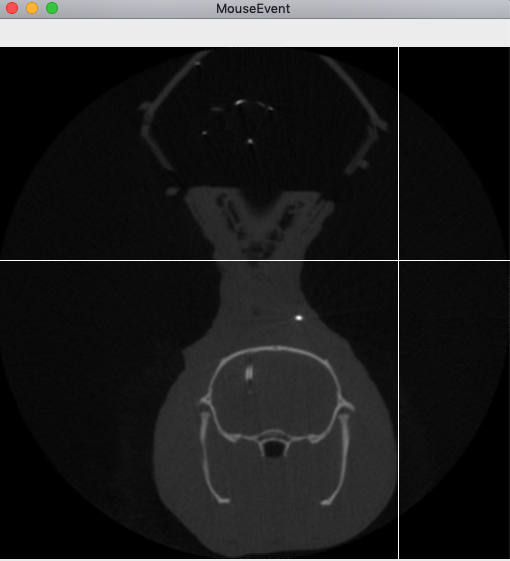
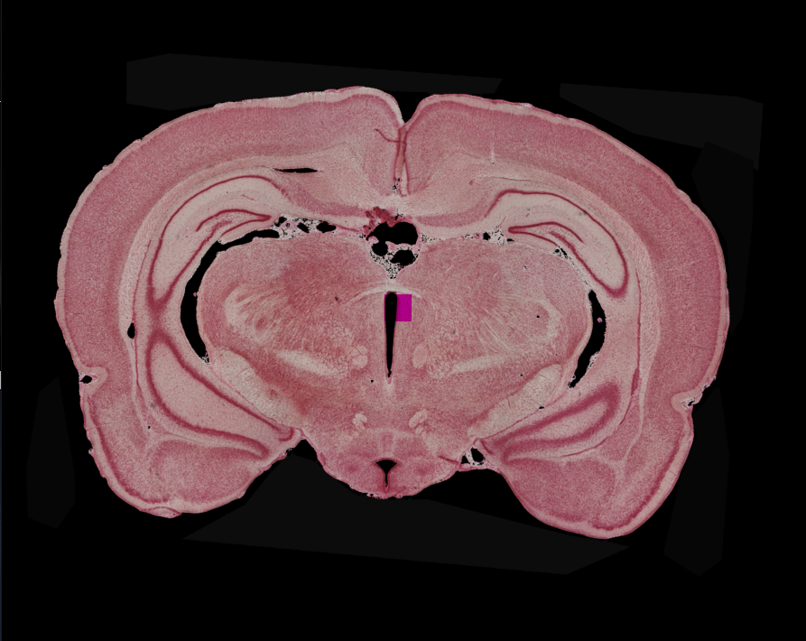

### これは脳CT画像と染色画像の位置合わせを行うツールです

### Setup
```
pip install -r requirements.txt
```

### Modify config
```
config.pyの変数を手元の画像ファイルに合わせて書き換えてください
```

### Run
```
python main.py
```

### 手順
- まず画像内で左クリックすることで前や後の画像に進めます。(左半分は前の画像へ、右半分は次の画像へ進みます)

- 特定の画像内で脳部分の左上と右下で右クリックするとその部分が指定されます

- 脳範囲の指定後、枠内の任意の点で右クリックをすると対応する点が塗られた染色画像が表示されます

- controlキーを押すことで作業を終了できます